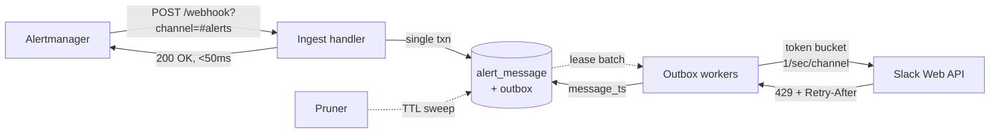

# ADR 001: Architecture for the Alertmanager → Slack threading relay

**Status:** Proposed
**Date:** 2026-07-20
**Supersedes:** nothing
**Context document:** [`000-prd.md`](./000-prd.md)
**Working codename:** `sturdy-telegram` (see [D12](#d12-project-name-license-and-open-source-posture))

---

## 0. Summary of decisions

| # | Decision | Choice |
|---|---|---|
| D1 | Language & stack | Rust — axum, tokio, sqlx, reqwest; dual MIT OR Apache-2.0 |
| D2 | Delivery architecture | Durable outbox: persist intent → ack fast → workers drain |
| D3 | Idempotency & HA | Atomic claim on `(fingerprint, channel)` primary key |
| D4 | State store | `StateStore` trait; SQLite default, PostgreSQL opt-in for HA |
| D5 | Message granularity | Per-fingerprint, with storm-collapse to a threaded group message |
| D6 | Resolve behaviour | In-place edit **and** threaded reply, each independently disableable |
| D7 | Repeat-firing behaviour | In-place refresh only — no thread spam, doubles as a state liveness probe |
| D8 | Channel routing | Read from webhook URL query param; Alertmanager keeps owning routing |
| D9 | Failure semantics | Every degradation path terminates in "post a plain message" |
| D10 | Rendering | Block Kit inside a coloured attachment, via an overridable MiniJinja template |
| D11 | Observability | Prometheus metrics with outbox-age as the primary SLO signal |
| D12 | Repo & licence | Standalone public repo; home-ops consumes it as a third-party app |

Deferred out of v1: the §2.1 passthrough endpoint, Slack interactivity, label-based routing rules.

---

## 1. Context

The PRD ([`000-prd.md`](./000-prd.md)) establishes the problem and settles the
"should we build this" question. This ADR resolves the eight open questions in PRD §8 and
specifies the architecture.

Two facts discovered while writing this ADR materially shaped the design and were not
accounted for in the PRD:

1. **Slack enforces roughly one `chat.postMessage` per second per channel.** This is a
   "Special Tier" limit, distinct from the numbered tiers, and it applies to thread replies
   too. Any design that posts synchronously inside the webhook handler will, during an alert
   storm, either block past Alertmanager's timeout or start dropping messages.

2. **The live Alertmanager config groups by `[alertname, job]`**
   (home-ops `kubernetes/apps/observability/kube-prometheus-stack/app/alertmanagerconfig.yaml`
   — `groupBy: [alertname, job]`,
   `groupInterval: 10m`, `groupWait: 1m`, `repeatInterval: 12h`). A single `KubePodNotReady`
   group can carry a dozen-plus alerts. Alertmanager posts **one** Slack message for that
   group today. Naïve per-fingerprint messaging turns one message into fifteen — a
   regression against the very problem the PRD is trying to solve, and one that collides
   head-on with fact (1).

These two facts are why the architecture below is an asynchronous durable pipeline rather
than the "receive → post → store ts" handler the PRD sketch implies.

---

## D1. Language and technology stack

**Decision: Rust.**

The PRD sketch (§7) proposed Go on ecosystem-fit grounds. That argument is weaker than it
appears on inspection: **this service touches no Kubernetes API and no Prometheus client
library.** It receives a JSON webhook, keeps a small amount of state, and calls three Slack
HTTP endpoints. There is no `client-go`, no controller-runtime, no informer, no
`promql`. The Go ecosystem advantage that normally dominates in this space simply does not
apply to this workload.

What Go would genuinely give us:

- `github.com/prometheus/alertmanager/template.Data` for free, instead of ~40 lines of
  hand-written `serde` structs. Real but trivial.
- A larger contributor pool in the observability niche. This is the one substantive cost,
  and it is accepted knowingly.

What Rust gives us that matters here:

- A ~8 MB static musl binary on `scratch`, ~15–30 MB RSS. The PRD's "minimal footprint"
  requirement is met with room to spare.
- `sqlx` compile-time-checked queries against **both** SQLite and PostgreSQL from one
  codebase — directly serving D4's dual-backend requirement.
- The type system does real work on the core invariant. `message_ts` being `Option<String>`
  until a post succeeds means "update a message we have not posted yet" is a compile error,
  not a 3am pager.

### Stack

| Concern | Choice | Notes |
|---|---|---|
| HTTP server | `axum` + `tower-http` | Tower middleware for timeouts, request IDs, tracing |
| Async runtime | `tokio` | multi-thread scheduler |
| Slack client | `reqwest` directly — **no SDK** | We call exactly three methods: `chat.postMessage`, `chat.update`, `auth.test`. `slack-morphism` is a large dependency surface for that. Hand-rolled is ~200 lines and gives exact control over 429/`Retry-After` handling, which is core to D2. |
| Serialization | `serde` / `serde_json` | |
| Persistence | `sqlx` (`sqlite` + `postgres` features) | Runtime-selected backend, compile-time-checked SQL |
| Templating | `minijinja` | Pure Rust, Jinja2 syntax, no C deps. See D10 |
| Metrics | `prometheus-client` | The official Prometheus-org Rust crate |
| Logging | `tracing` + `tracing-subscriber` | JSON to stdout; PRD §6 "clear, structured logging" |
| Config | `figment` | YAML file layered with env-var overrides |
| Errors | `thiserror` (library) / `anyhow` (binary) | Standard Rust split |
| Testing | `wiremock` + `sqlx` fixtures | See §Testing |

Rust edition 2024, MSRV pinned and tested in CI, `#![forbid(unsafe_code)]` at crate root.

**Rejected: Python.** Runtime footprint and deployment story are both worse for a service
whose entire value proposition is being small and boring enough to trust in the alerting path.

---

## D2. Delivery architecture: durable outbox

**Decision: the webhook handler persists intent and returns `200` immediately. Background
workers drain the outbox and perform Slack calls.**

This falls out of the two facts in §1 plus PRD goal #3 ("never silently drop").

The obvious alternative — post to Slack inside the request handler — fails in three ways:

- **Rate limits.** 15 alerts at 1 msg/sec means a 15-second handler. Alertmanager times out
  and retries, and now the same batch is in flight twice.
- **Crash window.** If we `200` before posting, a crash loses the alert silently. If we post
  before `200`ing, a crash *after* posting but *before* replying causes Alertmanager to
  retry a batch we already delivered — a duplicate.
- **Backpressure.** Slack being slow becomes Alertmanager being blocked.

The outbox resolves all three. The durable write happens *before* the ack, so nothing is
lost; the ack happens *before* the Slack call, so nothing blocks; and retries are our
problem to make idempotent (D3) rather than Alertmanager's problem to guess at.



The ingest handler's only job is to classify each alert in the batch and write rows. It does
no network I/O. Target p99 under 50 ms.

### Ingest classification

For each alert in the incoming batch, within one transaction:

**`status: firing`**

```sql
INSERT INTO alert_message (fingerprint, channel, state, group_key, first_seen, last_seen, ...)
VALUES (?, ?, 'claimed', ?, ?, ?, ...)
ON CONFLICT (fingerprint, channel) DO NOTHING
RETURNING id;
```

- **Row returned** → we created it, we own the notification → enqueue a `post` op.
- **No row returned** → it already exists. Then:
  - `state = 'claimed'` → another replica (or a retried delivery of this same batch) is
    already posting it. **No-op.** This is the duplicate-delivery case.
  - `state = 'posted'` and `last_seen` older than `refresh_debounce` (default 60 s) → a
    genuine `repeat_interval` re-send → enqueue a `refresh` op (see D7).
  - `state = 'posted'` and `last_seen` recent → duplicate delivery. **No-op.**

The `refresh_debounce` is what cleanly separates "Alertmanager retried the HTTP request"
(seconds apart) from "Alertmanager re-sent per `repeat_interval`" (12 hours apart) without
needing to reason about either timer.

**`status: resolved`**

```sql
UPDATE alert_message SET state = 'resolving', resolved_at = ?
WHERE fingerprint = ? AND channel = ? AND state IN ('claimed', 'posted')
RETURNING message_ts, thread_parent_ts;
```

- **Row updated** → enqueue a `resolve` op.
- **No row at all** → orphan resolve (PRD §5.5: relay was down, or state was lost).
  Enqueue a standalone `post` op rendering a resolved-style message. Increment
  `orphan_resolves_total`. **Never silent.**
- **Row exists but `state = 'resolving'`** → duplicate delivery. No-op.

### Ordering

Ops for the same fingerprint must not execute out of order — you cannot `chat.update` a
message you have not posted. This is enforced without any ordering machinery: a `resolve` op
whose `alert_message.message_ts` is still `NULL` re-schedules itself with backoff. If the
underlying `post` op eventually fails permanently, the `resolve` op falls back to posting a
standalone message (D9). Self-deferral is simpler and more robust than a dependency graph.

### Worker lease

Workers claim outbox rows with a lease, so a crashed worker's rows become reclaimable rather
than stuck:

```sql
-- PostgreSQL
UPDATE outbox SET leased_by = $1, leased_until = now() + interval '60 seconds',
                  attempts = attempts + 1
WHERE id IN (
  SELECT id FROM outbox
  WHERE next_attempt_at <= now() AND (leased_until IS NULL OR leased_until < now())
  ORDER BY id LIMIT $2
  FOR UPDATE SKIP LOCKED
)
RETURNING *;
```

`FOR UPDATE SKIP LOCKED` is the standard multi-consumer queue pattern and gives correct
behaviour with N replicas. SQLite has no `SKIP LOCKED`, but SQLite mode is single-replica by
definition (D4), so a `BEGIN IMMEDIATE` transaction is sufficient and equivalent. The trait
hides the difference.

### Rate limiting

Per-channel token bucket in front of the Slack client:

- `chat.postMessage` (including thread replies): 1/sec/channel.
- `chat.update`: Tier 3, 50/min, separate bucket.
- On HTTP 429, read `Retry-After`, set `next_attempt_at = now + Retry-After`, release the
  lease, and do **not** count it as a failed attempt.

**Honest limitation:** with N replicas each holds its own bucket, so the aggregate rate can
exceed Slack's limit. Mitigations, in order: set `slack.rate_limit_divisor` to the replica
count, and rely on 429 + `Retry-After` as the real backstop — which is precisely how Slack
expects clients to behave. A distributed token bucket in the database was considered and
rejected as a write-amplification cost out of proportion to the problem.

---

## D3. Idempotency and HA correctness

**Decision: idempotency comes from the `(fingerprint, channel)` primary key, claimed
atomically at ingest.**

Slack's Web API has **no idempotency key** on `chat.postMessage`. Sending the same request
twice produces two messages. Every duplicate must therefore be suppressed on our side, before
the call.

The `INSERT ... ON CONFLICT DO NOTHING RETURNING` in D2 is that suppression, and it is a
single atomic statement. It is correct under both concurrency sources simultaneously:

| Scenario | Outcome |
|---|---|
| Alertmanager retries a batch after our timeout | Second ingest sees `state='claimed'`, no-ops |
| Two replicas receive different batches containing the same fingerprint | Exactly one `INSERT` returns a row |
| Two replicas race the identical batch | Database serializes the conflict; one wins |
| Worker crashes mid-post | Lease expires, row reclaimed, retried |
| Worker posts to Slack then crashes before writing `message_ts` | **Duplicate message.** See below |

That last row is the one genuinely unresolvable case: the Slack call and the local commit
cannot be made atomic without two-phase commit against an API that does not support it. The
window is milliseconds wide, and the chosen failure direction is **duplicate, never silence**
— consistent with PRD goal #3, which explicitly prefers noise over loss. A `post` op that has
already exhausted `attempts` is not retried indefinitely; it dead-letters and alerts (D11).

---

## D4. State store

**Decision: a `StateStore` trait with two implementations. SQLite is the default;
PostgreSQL is opt-in and enables horizontal scaling.**

```rust
#[async_trait]
pub trait StateStore: Send + Sync {
    async fn claim_firing(&self, alert: &AlertKey, meta: &AlertMeta) -> Result<ClaimOutcome>;
    async fn mark_resolving(&self, alert: &AlertKey, at: DateTime<Utc>) -> Result<ResolveOutcome>;
    async fn enqueue(&self, ops: &[OutboxOp]) -> Result<()>;
    async fn lease_batch(&self, worker: &WorkerId, n: usize) -> Result<Vec<LeasedOp>>;
    async fn complete(&self, op: OpId, effect: OpEffect) -> Result<()>;
    async fn defer(&self, op: OpId, until: DateTime<Utc>) -> Result<()>;
    async fn prune(&self, policy: &RetentionPolicy) -> Result<PruneStats>;
}
```

Selected at startup by `STATE_BACKEND=sqlite|postgres`.

| | SQLite (default) | PostgreSQL (opt-in) |
|---|---|---|
| Replicas | Exactly 1, enforced at startup | N |
| Deploy strategy | `Recreate`, RWO PVC | `RollingUpdate`, no PVC |
| Dependency | None (bundled) | An existing PG (e.g. CloudNativePG) |
| Concurrency | `BEGIN IMMEDIATE`, WAL mode | `FOR UPDATE SKIP LOCKED` |

Both backends are exercised by **one shared conformance test suite** (§Testing), so the HA
path is continuously verified rather than theoretical. This is the main reason for building
both now rather than deferring PostgreSQL: a store abstraction with only one implementation
is an abstraction that is wrong in ways nobody has discovered yet.

If SQLite is configured and `replicas > 1` is detected (via the Downward API), the process
**refuses to start** with a clear error. Silently corrupting correlation state because
somebody scaled a Deployment is not an acceptable failure mode for an alerting component.

**Rejected:** bbolt/redb (no SQL, so TTL pruning and debugging both get harder, for a saving
of a few MB); Redis (PRD §3 rules it out as a dependency, and it is a weaker durability story
than either chosen backend); cluster etcd (absolutely not — coupling alert delivery to
control-plane etcd is the opposite of the reliability goal).

**Accepted cost:** two migration directories (`migrations/sqlite/`, `migrations/postgres/`)
because the type vocabularies differ (`INTEGER PRIMARY KEY` vs `BIGSERIAL`, `TEXT` timestamps
vs `TIMESTAMPTZ`). The conformance suite is what keeps them honest.

### Schema

Shown in PostgreSQL dialect. The SQLite migration is equivalent but uses
`INTEGER PRIMARY KEY AUTOINCREMENT` for `outbox.id` and `TEXT` for the `JSONB` and
`TIMESTAMPTZ` columns — SQLite has JSON *functions* but no JSON column type. This divergence
is exactly what the conformance suite exists to police.

```sql
CREATE TABLE alert_message (
  fingerprint       TEXT NOT NULL,
  channel           TEXT NOT NULL,
  state             TEXT NOT NULL,       -- claimed | posted | resolving | resolved | failed
  message_ts        TEXT,                -- NULL until the post succeeds
  thread_parent_ts  TEXT,                -- non-NULL if collapsed under a group message (D5)
  group_key         TEXT,                -- Alertmanager's groupKey
  first_seen        TIMESTAMPTZ NOT NULL,
  last_seen         TIMESTAMPTZ NOT NULL,
  resolved_at       TIMESTAMPTZ,
  labels            JSONB NOT NULL,
  annotations       JSONB NOT NULL,
  PRIMARY KEY (fingerprint, channel)
);

CREATE TABLE group_message (
  group_key   TEXT NOT NULL,
  channel     TEXT NOT NULL,
  message_ts  TEXT,
  member_count INTEGER NOT NULL DEFAULT 0,
  created_at  TIMESTAMPTZ NOT NULL,
  PRIMARY KEY (group_key, channel)
);

CREATE TABLE outbox (
  id              BIGSERIAL PRIMARY KEY,
  op              TEXT NOT NULL,          -- post | refresh | resolve | post_group
  channel         TEXT NOT NULL,
  fingerprint     TEXT,
  group_key       TEXT,
  payload         JSONB NOT NULL,
  attempts        INTEGER NOT NULL DEFAULT 0,
  next_attempt_at TIMESTAMPTZ NOT NULL,
  leased_by       TEXT,
  leased_until    TIMESTAMPTZ,
  last_error      TEXT,
  created_at      TIMESTAMPTZ NOT NULL
);

CREATE INDEX outbox_ready ON outbox (next_attempt_at) WHERE leased_until IS NULL;
CREATE INDEX alert_message_prune ON alert_message (resolved_at);
```

**Note the channel is part of the primary key**, not just the fingerprint. The PRD implies
`fingerprint -> {channel, ts}`, but if the same alert is ever routed to two channels, a
fingerprint-only key silently loses one of them. `(fingerprint, channel)` costs nothing and
removes the failure mode.

### Retention (PRD §5.7)

A background pruner runs every `retention.interval` (default 1 h):

- `state = 'resolved'` and `resolved_at` older than `retention.resolved` (default 7 d) → delete.
- Any state, `last_seen` older than `retention.stale` (default 30 d) → delete. Catches alerts
  that fire and never resolve, which would otherwise pin a row forever.
- `group_message` rows with no surviving members → delete.
- `outbox` rows completed successfully → deleted inline on completion.

---

## D5. Message granularity: per-fingerprint with storm collapse

**Decision: one message per fingerprint by default. When a batch would exceed
`collapse_threshold` new messages in one channel, post a single group summary message and
thread the individual alerts beneath it.**

This resolves the tension identified in §1 fact (2). Per-fingerprint messaging is the entire
point of the project — it is what makes `chat.update` on resolve possible at all — but
unconditional per-fingerprint messaging makes a 15-pod `KubePodNotReady` group noisier than
the status quo.

Collapse behaviour:

- Keyed on Alertmanager's `groupKey`, which is supplied in the webhook payload. No key needs
  inventing.
- Triggered when a single ingest batch produces more than `collapse_threshold` (default **5**)
  new `post` ops for one channel.
- **Sticky:** once a `group_key` has a `group_message` row, later alerts joining that group
  thread under it even if they arrive in a small batch. Otherwise a group's alerts would be
  split between top-level messages and thread replies depending on batch timing, which is
  worse than either consistent behaviour.
- Each child alert still gets its own `alert_message` row with `thread_parent_ts` set, so
  **per-alert resolve still updates the correct child message in place.** Correlation
  fidelity is fully preserved; only the visual placement changes.
- The parent message shows a live firing/resolved count, refreshed via `chat.update` as
  children resolve.

The parent posts immediately; children fill in at 1/sec. A 15-alert storm shows a correct
summary within a second and a fully populated thread within ~15 seconds.

Setting `collapse_threshold: 0` disables collapse entirely for anyone who prefers strict
per-alert messages.

---

## D6. Resolve behaviour

**Decision: both an in-place edit and a threaded reply, each independently disableable via
config. Both default on.**

They solve genuinely different problems, and the relevant Slack behaviour makes this clear:

- **`chat.update` does not bump the message, does not mark the channel unread, and does not
  notify.** So an in-place edit alone is *invisible to anyone watching the channel live*.
  What it does give you is a channel history that is accurate whenever you scroll it.
- **A threaded reply generates an unread indicator** on the parent message, so a live watcher
  sees the resolution happen. With `reply_broadcast: false` it does not re-post to the
  channel, so it costs no channel noise.

```
┌──────────────────────────────────┐
│ ✅ RESOLVED   CephOSDDown        │   ← attachment colour red → green
│ osd.3 · ceph-node-2              │
│ fired 14:02 → resolved 14:31     │
│ duration 29m                     │
└──────────────────────────────────┘
  └─ 💬 1 reply
     ✅ Resolved after 29m          ← generates the unread
```

Config:

```yaml
resolve:
  update_in_place: true    # rewrite the original message
  thread_reply: true       # post a threaded reply
```

Setting both to `false` is a config error and refuses to start — a resolve that does nothing
is indistinguishable from the bug this project exists to fix.

---

## D7. Repeat-firing behaviour (PRD §8.2)

**Decision: refresh the original message in place. No thread reply, no re-post.**

The PRD asked for one of (a) no-op, (b) "still firing" thread reply, (c) in-place edit, with
justification. Choosing (c):

- With `repeatInterval: 12h`, option (b) would add a thread reply twice a day per long-running
  alert. The project exists to reduce alert-channel noise; adding a recurring notification is
  working against the goal.
- Option (a) leaves a message reading "since 14:02" with no indication whether that is still
  true or whether the relay died three hours ago.
- Option (c) updates a "still firing · confirmed 14:31 · for 12h4m" line. The message stays in
  place in history (no bump — see D6), which is correct: channel position should not be a
  proxy for alert state.

The decisive argument is a property the other options lack. **`chat.update` returning
`message_not_found` is a free liveness probe on our own state.** If someone deleted the
message, or `message_ts` is stale, we learn about it on the next repeat and can self-heal by
clearing state and re-posting — rather than discovering at resolve time that the message we
were going to update no longer exists. Every repeat interval silently validates our
correlation state at zero cost.

An escalating "still firing after N repeats" notification is a plausible future feature but
is deliberately not in v1.

---

## D8. Channel routing (PRD §8.7)

**Decision: the channel is read from the webhook URL query string, falling back to a
configured default. No routing rules in the relay for v1.**

```yaml
receivers:
  - name: slack-critical
    webhook_configs:
      - url: http://sturdy-telegram.observability.svc.cluster.local:8080/webhook?channel=%23alerts-critical
        send_resolved: true
```

Alertmanager already has a complete, battle-tested routing tree, and PRD §3 explicitly says
we are not replacing it. Re-implementing label matching inside the relay would duplicate that
logic and create two places where routing can be wrong. Passing the channel as a URL
parameter lets the existing `route` tree drive channel selection with no new concepts.

Resolution order: `?channel=` → `slack.default_channel` → refuse to start.

⚠️ Two Alertmanager settings will break the relay if changed, and both belong in the README's
troubleshooting section:

- **`send_resolved: true` is mandatory.** It defaults to `true`, but if it is ever set
  `false` the relay never learns about resolutions and every message stays red forever.
- **`max_alerts` must stay at its default of `0`.** Any non-zero value causes Alertmanager to
  **truncate** alerts out of the webhook body. Truncated alerts are never tracked, so their
  eventual `resolved` notifications arrive as orphans (D9) and surface as standalone
  messages with no correlation. A rising `orphan_resolves_total` with no restarts is the
  signature of this misconfiguration — worth calling out explicitly, because the symptom
  (degraded correlation) points nowhere near the cause.

Label-based routing rules in relay config are deferred; if demand appears, they slot in as a
lower-priority resolution step without changing anything above.

---

## D9. Failure semantics

**Decision: every degradation path terminates in "post a plain message". Silence is never a
valid outcome.** (PRD goals #3, §6.)

| Failure | Behaviour |
|---|---|
| Resolve for an untracked fingerprint | Post a standalone resolved message. `orphan_resolves_total++` |
| `chat.update` → `message_not_found` | Clear `message_ts`, post a fresh message |
| `chat.update` → any other error | Retry with backoff; on exhaustion, post a standalone message |
| Resolve arrives while `message_ts` is `NULL` | Self-defer with backoff; on timeout, post standalone |
| Template rendering panics or errors | Fall back to a hardcoded minimal text message. **Never** drop |
| Store unreachable at ingest | Return `503`. Alertmanager retries — this is the one case where refusing the request is correct, because Alertmanager's own retry is more durable than anything we could do |
| Slack 429 | Honour `Retry-After`, do not count as a failed attempt |
| Slack 5xx | Exponential backoff with jitter, up to `max_attempts` (default 10, ~30 min) |
| Slack `invalid_auth` | Dead-letter immediately, do not burn retries, fire a metric |
| Outbox op exhausts attempts | Dead-letter, `dead_letter_total++`, log full payload at ERROR |

The hardcoded-minimal-template fallback deserves emphasis. A user-supplied template (D10) is
the most likely thing to break in production, and it must not be able to take alerting down.
Templates render in a catch-and-fall-back wrapper, always.

---

## D10. Message rendering

**Decision: Block Kit blocks wrapped in a legacy `attachment` for the colour bar, rendered
through a built-in MiniJinja template that users may override.**

The colour bar (red firing / green resolved) is the highest-signal element for scanning a
channel, and Block Kit has no native colour concept — the only way to get it is the
`attachments` array with `color` set and `blocks` nested inside. This is well-trodden, if
slightly inelegant, Slack practice.

Templates are overridable via ConfigMap because forking a Go/Rust binary to change message
wording is a genuine adoption barrier for an OSS tool, and MiniJinja costs very little. Four
templates ship built in: `firing`, `resolved`, `group_summary`, `thread_reply`.

Rendering is always wrapped in the D9 fallback.

---

## D11. Observability

`GET /healthz` — liveness. Process-alive only. **Deliberately does not check the store**: a
brief database blip must not cause Kubernetes to restart a pod that is correctly buffering.

`GET /readyz` — readiness. Checks store reachability and Slack auth validity.

`GET /metrics` — Prometheus:

```
sturdy_telegram_alerts_received_total{status}
sturdy_telegram_slack_calls_total{method,outcome}
sturdy_telegram_slack_call_duration_seconds{method}     histogram
sturdy_telegram_outbox_depth{op}
sturdy_telegram_outbox_oldest_age_seconds               ← primary SLO signal
sturdy_telegram_tracked_fingerprints
sturdy_telegram_orphan_resolves_total                   ← state was lost
sturdy_telegram_fallback_posts_total{reason}            ← degraded but not silent
sturdy_telegram_dead_letter_total{reason}               ← SILENT: page on this
sturdy_telegram_rate_limited_total{method}
```

`outbox_oldest_age_seconds` is the metric that actually means "alerts are not reaching
Slack". It is the one to alert on, more than error counters.

⚠️ **Circular dependency, and it is a real one.** The relay's own alerts must not be routed
*through* the relay — if the relay is down, an alert about the relay being down cannot be
delivered by the relay. The shipped `PrometheusRule` must be accompanied by documentation
requiring an Alertmanager route that sends `job=sturdy-telegram` alerts to a **direct Slack
receiver**, bypassing the relay entirely. This is the single most important operational note
in the README.

### Security

- Optional bearer token on the webhook endpoint (`http_config.authorization.credentials` on
  the Alertmanager side). Cluster-internal, but cheap.
- Bot token read from env/file, never logged; a redacting `Debug` impl on the config type.
- Container: non-root, read-only root filesystem, all capabilities dropped, seccomp
  `RuntimeDefault`.
- Startup calls `auth.test` once and logs the resolved bot identity, failing fast on a bad token.

---

## D12. Project name, licence, and open-source posture

**Repository: standalone public GitHub repo. Not inside home-ops.** (PRD §8.6.)

The prior research found sustained upstream demand (100+ 👍 across
[alertmanager#2165](https://github.com/prometheus/alertmanager/issues/2165) and
[#3221](https://github.com/prometheus/alertmanager/issues/3221)) and no maintained tool in the
niche. home-ops holds only the deployment manifests, consuming this the same way it consumes
any third-party app.

**Licence: `MIT OR Apache-2.0` (dual).** This is the near-universal Rust ecosystem
convention. It satisfies the stated MIT preference while adding Apache-2.0's explicit patent
grant, and dual-licensing lets downstream consumers pick whichever fits their compliance
posture. Both `LICENSE-MIT` and `LICENSE-APACHE` at repo root, SPDX headers in source.

**Name — provisionally `sturdy-telegram`.** The repository already exists under that name
(GitHub's auto-suggestion), and it is used throughout this document. It is memorable, and
opaque tool names have ample precedent in this ecosystem provided the repo description and
README carry the discovery load — which for this project means leading with the literal
search phrase, *"Alertmanager → Slack relay with fingerprint-keyed threading and
update-on-resolve."*

The counter-argument is that a descriptive name such as `alertthread` is findable by someone
searching "alertmanager slack thread", and that discovery is the whole point of publishing
given the 100+ upvoters who are looking for exactly this. **Renaming is free until the first
tagged release and expensive after**, once people have pulled images and pinned chart
versions. Flagged as a decision point, not a blocker.

### Distribution

- Multi-arch (`amd64`/`arm64`) images to `ghcr.io`, distroless static or `scratch`.
- Helm chart published as an OCI artifact to `ghcr.io` — matching the `ocirepository.yaml`
  pattern home-ops already uses for Kromgo, so consumption is a solved problem on day one.
- Cosign keyless signing + SBOM attestation. Cheap in CI, and materially raises trust for
  the Kubernetes audience most likely to adopt this.
- Renovate-friendly semver tags; `release-please` for changelog and release automation.
- CI: `cargo clippy -D warnings`, `cargo fmt --check`, `cargo deny`, full test suite against
  both store backends, MSRV check.

---

## Testing strategy

The correctness claims in D3 are only worth anything if they are tested.

1. **Store conformance suite.** One set of tests, parameterised over both backends. Every
   claim in D3's table is a test case. This is the highest-value suite in the project.
2. **Concurrency tests.** N tasks racing the identical fingerprint; assert exactly one `post`
   op is created. Run against PostgreSQL with real connections.
3. **Slack API fake.** `wiremock` serving `chat.postMessage` / `chat.update`, including 429
   with `Retry-After` and `message_not_found`, so the D9 table is directly exercised.
4. **Golden payloads.** Real captured Alertmanager webhook bodies as fixtures — grouped,
   single, firing, resolved, mixed — with snapshot-tested rendered Block Kit output.
5. **Crash-recovery tests.** Kill a worker mid-lease; assert the row is reclaimed and the op
   completes.

---

## Consequences

**Positive**

- Ack latency is decoupled from Slack latency; alert storms degrade to "slower", never "lost".
- Correlation state and delivery state live in one transactional store, so the crash windows
  are enumerable — and enumerated (D3).
- HA is a config change, not a rewrite, and is continuously tested rather than aspirational.
- Small enough to audit: no SDK, no framework magic, ~8 MB binary.

**Negative**

- Meaningfully more machinery than the PRD's sketch implied. The outbox, leasing, and dual
  backends are perhaps 2–3× the code of a synchronous handler. The justification is §1's two
  facts, not architectural taste.
- Two migration directories to keep in sync (mitigated by the conformance suite).
- Smaller potential contributor pool than Go (D1, accepted).
- One unresolvable duplicate-message window (D3), chosen deliberately over any risk of silence.

**Deferred, explicitly**

- **The §2.1 passthrough endpoint.** Concurring with the PRD's own leaning and its prior
  research: it converts four independent notification paths into one shared dependency in the
  alerting path, in exchange for solving a cosmetic secret-duplication annoyance that sops
  already handles. Not in v1. Revisit only with the redundancy requirements of PRD §6 met.
- Slack interactivity (a "Silence 1 h" button hitting Alertmanager's silence API). Genuinely
  compelling, and genuinely adjacent to PRD non-goal §3.2. Not v1.
- Label-based routing rules in relay config (D8).
- Escalating repeat-firing notifications (D7).
- A `/still-firing` slash command.

---

## Open questions remaining

1. **Project name** — keep `sturdy-telegram` or rename to something descriptive. Free until
   the first tagged release, expensive after (D12).
2. **`collapse_threshold` default of 5** — a guess. Should be revisited against real alert
   volume after a few weeks of running.
3. **Should the group summary message list member alerts in its body**, in addition to
   threading them? Adds redundancy, but makes the collapsed view useful without expanding the
   thread. Leaning yes for small groups (≤10), truncated above that.
