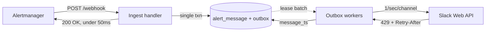

# Why an outbox

*Why the webhook handler persists intent and returns immediately, instead of posting to
Slack inline.*

The obvious design is the one the PRD sketched: receive the webhook, post to Slack, store
the timestamp, return `200`. It is four steps, it needs no background worker, and it is
wrong in three separate ways. This page works through each, then through what the outbox
costs.

The decision is [ADR 001 D2](../adr/001-adr.md); the identity that makes retries safe is
covered in [fingerprint correlation](fingerprint-correlation.md).

## Three ways the synchronous handler fails

### 1. Rate limits

Slack allows roughly **one `chat.postMessage` per second per channel**. This is a "Special
Tier" limit, separate from the numbered tiers, and it applies to thread replies too.

The live Alertmanager this was built for groups by `[alertname, job]`. One
`KubePodNotReady` group routinely carries a dozen or more alerts. Fifteen alerts at one per
second is a fifteen-second handler. Alertmanager times out long before that, retries, and
now the same batch is in flight twice — while the first attempt is still posting.

This is not a tail-latency problem that goes away with a faster machine. The limit is on
Slack's side and it binds exactly when alerting matters most.

### 2. The crash window

Somewhere in the handler there is a durable write and a Slack call, and they cannot be
made atomic. Whichever order you choose, a crash between them is a defined failure:

- **Acknowledge before posting** and a crash loses the alert. Alertmanager believes it was
  delivered and will not retry. Silence.
- **Post before acknowledging** and a crash after the post causes Alertmanager to retry a
  batch that was already delivered. Duplicate.

A synchronous handler has to pick one. Neither is good, and the first is unacceptable here.

### 3. Backpressure

Slack being slow becomes Alertmanager being blocked. A degradation in a chat service
propagates into the alerting pipeline, which is the wrong direction for a dependency to
fail in.

## What the outbox changes

The handler classifies each alert in the batch and writes rows — an `alert_message` row and
an `outbox` row per decision — inside one transaction. It commits, returns `200`, and does
no network I/O at all. Background workers lease outbox rows and make the Slack calls.



Each of the three failures dissolves:

- **The durable write happens before the ack**, so a crash at any point after `200` loses
  nothing — the work is in the database.
- **The ack happens before the Slack call**, so handler latency is a database write, not a
  rate-limited API round trip. Target p99 is under 50 ms regardless of batch size.
- **Retries become our problem**, paced by our own token bucket and by Slack's
  `Retry-After`, rather than Alertmanager's problem to guess at with a timeout.

The reordering is the entire trick: it converts "did the Slack call succeed?" — a question
we cannot answer atomically — into "is the row committed?", which we can.

## Why this shape puts every decision in a pure function

The outbox has a second consequence that was not the reason for choosing it but is the
reason the codebase looks the way it does.

Once delivery is asynchronous, the request path is: claim, decide, persist. The claim must
be a database statement, because its correctness *is* the database's atomicity. Persisting
is a database write. **Everything in between is arithmetic on values** — which alerts are
new, whether this batch is a storm, whether enough time has passed for a repeat to count as
a repeat.

So it is one pure function:

```rust
plan(outcomes, batch, group, policy, now) -> Plan
```

No clock read, no I/O, no runtime, no mocks in its tests. The `now` is passed in, and the
crate cannot read a clock even by accident: it depends on `chrono` without the `clock`
feature, so `Utc::now()` does not exist there.

A synchronous handler cannot be factored this way. Its decisions are interleaved with its
Slack calls, so testing "what happens when a storm of fifteen alerts arrives while three of
them are already posted?" means standing up a fake Slack and a database. Here it is a
function call with a literal argument. That is why this logic was built first, before any
storage or HTTP work existed to be thrown away if the shape was wrong.

## Ordering, without an ordering mechanism

The obvious worry about a queue is ordering: you cannot edit a message you have not posted.

There is no dependency graph and no sequencing machinery. A resolve op whose alert has no
message timestamp yet simply **re-schedules itself** with backoff. If the underlying post
eventually fails for good, the resolve falls back to posting a standalone message (D9).

Self-deferral is less clever than a dependency graph and considerably more robust. There is
no ordering state to become inconsistent, and the failure mode of the fallback is a message
that is slightly less pretty rather than a message that never arrives. The core encodes
this in the type it hands the worker: a resolve either carries a real message timestamp or
carries `AwaitingPost`, so "update a message we have not posted yet" is not expressible.

## What it costs

This is meaningfully more machinery than the synchronous handler — the outbox table, the
lease protocol, the worker loop, the per-channel token bucket, and a pruner. ADR 001 puts
it at two to three times the code, and that estimate is not defended as architectural
taste; it is the price of the two facts above.

Two costs are worth stating plainly.

**Delivery is no longer immediate.** A `200` means "durably accepted", not "posted to
Slack". The gap is normally milliseconds and during a storm it is seconds to tens of
seconds. This is why `alertthread_outbox_oldest_age_seconds` is the metric to alert on and
not the error counters: it is the one that means *alerts are not reaching Slack*, whether
the cause is rate limiting, a Slack outage, or a wedged worker.

**One window is still open.** A worker can post to Slack and then crash before writing the
returned timestamp. The lease expires, the row is reclaimed, and the alert is posted twice.
This cannot be closed without two-phase commit against an API that does not offer it, and
the window is milliseconds wide.

Both remaining failure modes point the same way, and that is the point:

> A duplicate message is a nuisance. A dropped alert is an outage nobody hears about.

Every trade-off in this design resolves in that direction. If a future change makes the
pipeline simpler at the cost of a path where an alert can go unposted, the simplification
is not worth it.
